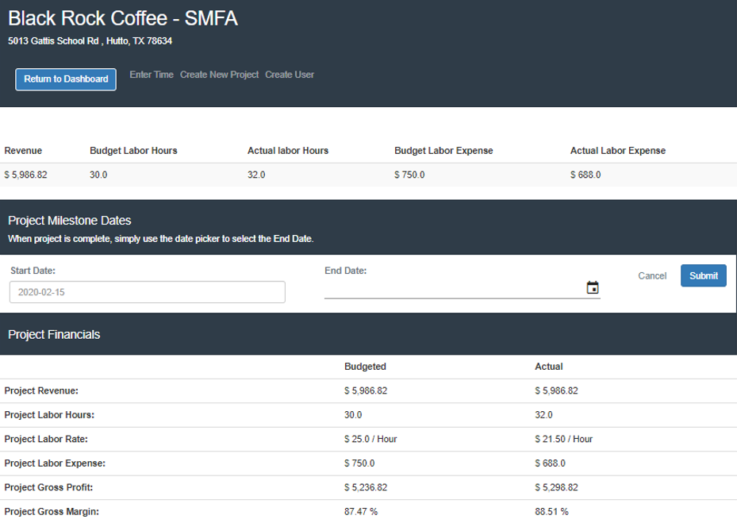

# Job Costing App

## Table of contents
* [General info](#general-info)
* [Screenshots](#screenshots)
* [Technologies](#technologies)
* [App Workflow](#app-workflow)
* [Features](#features)
* [Limitations](#limitations)
* [Improvements](#improvements)

## General info

Smaller Construction management teams have less resources and time to keep up with their busy days. Other than managing the team and projects they need to focus on the financial timelines and discussing projects with Stakeholders. The Job Costing App will make user experience with project management tools friendlier and allows them to give live updates to their customers, clients, bosses.

This app will allow for the leads to see progress in the financial and day to day workload by tracking and visualizing budgeted labor values and comparing them to the actual labor values. This limits the back and forth of chasing employees around for timesheets and daily progress. Knowing when a project is exceding budgeted time is often the first step to preventing a project from become a major loss.

## Screenshots

 
 
 

## Technologies
* Python 
* Flask
* Psycopg2
* PostgresSQL
* JavaScript
* HTML
* CSS
* Bootstrap
* Plotly

## App Workflow

## Features
* Enter a new project
* Enter a new user
* Enter a time sheet
* View overall company details
* View individual project details

## Limitations
* App performance
* App navigation
* No options yet to update or delete data from the database
* Currently only tracks labor expense

## Improvements:
* Create routes for updating and deleting data.
* Add status updates and percentage complete for each project.
* Expand database to include a full range of expenses for projects such as: materials, subcontractors, sales tax, overhead, labor burden, and overtime.
* Add features that would make this a full project management app: pdf document storage, time sheet tracking, change order tracking, and the ability for customers, subcontractors, and venders to access the app.
* Authentication for users.